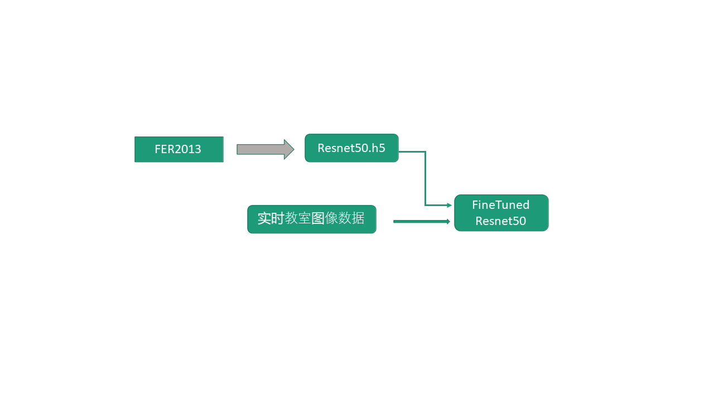

#  课堂学生注意力观察系统 : student_emotion

### 概要介绍

本项目的目的是通过课堂上实时观察同学们的实时表情，以神经网络模型作为判断，推断大家的情绪，以及专注度，得出重要的信息反馈给老师同学，便于同学自查自纠，辅助老师掌握课堂接受情况。本项目使用了预先训练好的基于ImageNet的神经网络ResNet50作为基础模型，在此基础上，我们利用了FER2013学生表情数据集，进行二次训练。 最终得出可以用来部署的模型。  

### 详细项目设计 
基本的框架图如下图所示

### 基本模型
基础模型我们选择了普遍使用的ResNet50模型，我们曾经使用过更为简单的MobileNet模型，但效果不理想。 最终选择Resnet50为基线。 

- 我们从Google Tensorflow 下载基于ImageNet 预训练好的Resnet 模型
- 我们选择整个网络的末75层作为训练层，前面的层数都freeze 住
       for layer in resnet_model.layers:
                layer.trainable = False
       for layer in resnet_model.layers[-75:]:
                layer.trainable = True

### 基本数据
我们采用了Keggle提供的FER-2013数据集，每张图片有7种情绪标签。 
1. 35887 张样本图像数据
2. 数据集是一个非均衡的数据集。 Angry(4953), Disgust(547), Fear5121)，Happy(8989),Sad(6077) and Neutral(6198)
3. 48x48的黑白图像

我们将其拆分成训练集,测试集和Validaton集三部分。 （https://www.kaggle.com/msambare/fer2013） 

### 训练过程
训练过程的代码在student_emotion.ipynb， 大概60多个epoch,我们达到了80%的准确率，训练过程趋于平坦， 我们认为这基本满足诉求。 这个数据集在进行人工测试时也只有65%+/-5%的准确率，我们认为这个结果可以接受

